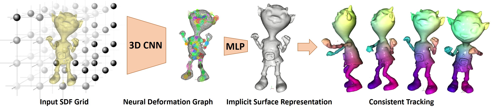

# Neural Deformation Graphs

### [Project Page](https://aljazbozic.github.io/neural_deformation_graphs/) | [Paper](https://arxiv.org/abs/2012.01451) | [Video](https://www.youtube.com/watch?v=vyq36eFkdWo)
<br />

> Neural Deformation Graphs for Globally-consistent Non-rigid Reconstruction <br />
> [Aljaž Božič](https://aljazbozic.github.io/), [Pablo Palafox](https://pablorpalafox.github.io/), [Michael Zollhöfer](https://zollhoefer.com/), [Justus Thies](https://justusthies.github.io/), [Angela Dai](https://www.3dunderstanding.org/index.html), [Matthias Nießner](https://www.niessnerlab.org/members/matthias_niessner/profile.html) <br />
> CVPR 2021 (Oral Presentation)


<p align="center">
  
</p>

This repository contains the code for the CVPR 2021 paper [Neural Deformation Graphs](https://arxiv.org/abs/2012.01451), a novel approach for globally-consistent deformation tracking and 3D reconstruction of non-rigid objects.

Specifically, we implicitly model a deformation graph via a deep neural network and empose per-frame viewpoint consistency as well as inter-frame graph and surface consistency constraints in a self-supervised fashion.

That results in a differentiable construction of a deformation graph that is able to handle deformations present in the whole sequence.

<p align="center">
  
</p>


## Install all dependencies

- Download the latest conda [here](https://docs.conda.io/projects/conda/en/latest/user-guide/install/download.html).

- To create a conda environment with all the required packages using conda run the following command:

```
conda env create -f resources/env.yml
```

> The above command creates a conda environment with the name **ndg**.


- Compile external dependencies inside `external` directory by executing:

```
conda activate ndg
./build_external.sh
``` 
> The external dependencies are **PyMarchingCubes**, **gaps** and **Eigen**.


## Generate data for visualization & training

In our experiments we use depth inputs from 4 camera views. These depth maps were captured with 4 Kinect Azure sensors. For quantitative evaluation we also used synthetic data, where 4 depth views were rendered from ground truth meshes. In both cases, screened Poisson reconstruction (implemented in [MeshLab](https://www.meshlab.net)) was used to obtain meshes for data generation. An example sequence of meshes of a synthetic **doozy** sequence can be downloaded [here](https://drive.google.com/file/d/12DYzj3CR-1dlnDDWO_ZVFnphoAmMT3hX/view?usp=sharing).

To generate training data from these meshes, they need to be put into a directory `out/meshes/doozy`. Then the following code executes data generation, producing generated data samples in `out/dataset/doozy`:

```
./generate_data.sh
```

## Visualize neural deformation graphs using pre-trained models

After data generation you can already check out the neural deformation graph estimation using a [pre-trained model checkpoint](https://drive.google.com/file/d/1d0Rdb3_bwP6BHRGjxG_mdixfxqpza_Ys/view?usp=sharing). You need to place it into the `out/models` directory, and run visualization:
```
./viz.sh
```

Reconstruction visualization can take longer, if you want to check out graphs only, you can uncomment `--viz_only_graph` argument in `viz.sh`.

Within the [Open3D](http://www.open3d.org/) viewer, you can navigate different settings using these keys:

* `N`: toggle graph nodes and edges
* `G`: toggle ground truth
* `D`: show next
* `A`: show previous
* `S`: toggle smooth shading


## Train a model from scratch

You can train a model from scratch using `train_graph.sh` and `train_shape.sh` scripts, in that order. The model checkpoints and tensorboard stats are going to be stored into `out/experiments`.


### Optimize graph 
To estimate a neural deformation graph from input observations, you need to specify the dataset to be used (inside `out/dataset`, should be generated before hand), and then training can be started using the following script:

```
./train_graph.sh
```

We ran all our experiments on NVidia 2080Ti GPU, for about 500k iterations. After the model has converged, you can visualize the optimized neural deformation graph using `viz.sh` script.

To check out convergence, you can visualize loss curves with `tensorboard` by running the following inside `out/experiments` directory:
```
tensorboard --logdir=.
```


### Optimize shape

To optimize shape, you need to initialize the graph with a pre-trained graph model. That means that inside `train_shape.sh` you need to specify the `graph_model_path`, which should point to the converged checkpoint of the graph model (graph model usually converges at around 500k iterations). Multi-MLP model can then be optimized to reconstruct shape geometry by running:

```
./train_shape.sh
```

Similar to graph optimization also shape optimization converges in about 500k iterations.


## Citation

If you find our work useful in your research, please consider citing:

    @article{bozic2021neuraldeformationgraphs,
    title={Neural Deformation Graphs for Globally-consistent Non-rigid Reconstruction},
    author={Bo{\v{z}}i{\v{c}}, Alja{\v{z}} and Palafox, Pablo and Zollh{\"o}fer, Michael and Dai, Angela and Thies, Justus and Nie{\ss}ner, Matthias},
    journal={CVPR},
    year={2021}
    }


## Related work

Some other related works on non-rigid reconstruction by our group:
* [Bozic et al. DeepDeform: Learning Non-rigid RGB-D Reconstruction with Semi-supervised Data (2020)](https://niessnerlab.org/projects/bozic2020deepdeform.html)
* [Li et al. Learning to Optimize Non-Rigid Tracking (2020)](https://niessnerlab.org/projects/li2020learning.html)
* [Bozic et al. Learning to Optimize Non-Rigid Tracking (2021)](https://www.niessnerlab.org/projects/bozic2020nnrt.html)


## License

The code from this repository is released under the MIT license, except where otherwise stated (i.e., `Eigen`).