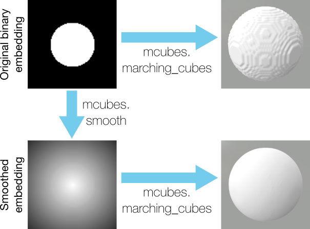
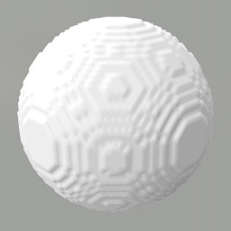
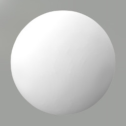

# PyMarchingCubes

`PyMarchingCubes` is a fork from `PyMCubes`, with a different implementation of the actual marching function (see 'marching_cubes/src/marchingcubes.h').
It fixes some issues of the original implementation that let to wrong triangulation (visible in triangles that are larger than the actual 'marching cell').


### Color Interpolation
The module also includes a marching cubes with color interpolation:
``` marching_cubes_color ``` and ``` marching_cubes_color_func ```.
Have a look at the 'examples/spheres.py' file.
Basically, it is called with ``` marching_cubes_color(sdf_volume, rgb_volume, iso_level) ``` assuming a 3D grid for the sdf values (dim_x,dim_y,dim_z) and a 4D grid for the colors (dim_x,dim_y,dim_z,3).


The export functions for obj and off files are adapted accordingly to handle the vertex colors.


### Super sampling along the edges
In case you are using a truncated signed distance function, you might miss the correct zero-crossing because of undersampling. Increasing the sample volume grows cubically, instead one can also subsample along the edges of a coarser volume to find a better approximation of the zero-crossing.
This subsampling of the edges is achieved by sampling along the x,y,z axis independently with higher resolution (e.g., you sample (dim_x + (dim_x-1)*edge_sampling, dim_y, dim_z) for the edges along the x axis).
The computational cost grow linear with the number of subsamples (e.g. 10 subsamples result in ~30 times more samples that you have to provide (since you need 10 times more samples per axis)).
A modified marching cubes implementation can be called via ``` marching_cubes_super_sampling(sdf_x, sdf_y, sdf_z, iso_level) ```.
Have a look at the sphere example.


Other than that, this repository is the same as the original (https://github.com/pmneila/PyMCubes).

## Installation

```
git clone https://github.com/JustusThies/PyMarchingCubes.git
cd PyMarchingCubes
git clone https://gitlab.com/libeigen/eigen.git
python setup.py install
```


## Example from the original `PyMCubes`

The following example creates a `NumPy` volume with spherical iso-surfaces and
extracts one of them (i.e., a sphere) with `mcubes.marching_cubes`. The result
is exported to `sphere.dae`:

```Python
  >>> import numpy as np
  >>> import marching_cubes as mcubes

  # Create a data volume (30 x 30 x 30)
  >>> X, Y, Z = np.mgrid[:30, :30, :30]
  >>> u = (X-15)**2 + (Y-15)**2 + (Z-15)**2 - 8**2

  # Extract the 0-isosurface
  >>> vertices, triangles = mcubes.marching_cubes(u, 0)

  # Export the result to sphere.dae
  >>> mcubes.export_mesh(vertices, triangles, "sphere.dae", "MySphere")
```

Alternatively, you can use a Python function to represent the volume instead of
a `NumPy` array:

```Python
  >>> import numpy as np
  >>> import marching_cubes as mcubes

  # Create the volume
  >>> f = lambda x, y, z: x**2 + y**2 + z**2

  # Extract the 16-isosurface
  >>> vertices, triangles = mcubes.marching_cubes_func((-10,-10,-10), (10,10,10),
  ... 100, 100, 100, f, 16)

  # Export the result to sphere.dae (requires PyCollada)
  >>> mcubes.export_mesh(vertices, triangles, "sphere.dae", "MySphere")

  # Or export to an OBJ file
  >>> mcubes.export_obj(vertices, triangles, 'sphere.obj')
```

Note that using a function to represent the volumetric data is **much** slower
than using a `NumPy` array.

## Smoothing binary arrays



Many segmentation methods build binary masks to separate _inside_ and _outside_
areas of the segmented object. When passing these binary mask to the marching
cubes algorithm the resulting mesh looks jagged. The following code shows an
example with a binary array embedding a sphere.
```Python
x, y, z = np.mgrid[:100, :100, :100]
binary_sphere = (x - 50)**2 + (y - 50)**2 + (z - 50)**2 - 25**2 < 0

# Extract the 0.5-levelset since the array is binary
vertices, triangles = mcubes.marching_cubes(binary_sphere, 0.5)
```


`PyMCubes` provides the function `mcubes.smooth` that takes a 2D or 3D binary
embedding function and produces a smooth version of it.
```Python
smoothed_sphere = mcubes.smooth(binary_sphere)

# Extract the 0-levelset (the 0-levelset of the output of mcubes.smooth is the
# smoothed version of the 0.5-levelset of the binary array).
vertices, triangles = mcubes.marching_cubes(smoothed_sphere, 0)
```


`mcubes.smooth` builds a smooth embedding array with negative values in the
areas where the binary embedding array is 0, and positive values in the areas
where it is 1. In this way, `mcubes.smooth` keeps all the information from the
original embedding function, including fine details and thin structures that
are commonly eroded by other standard smoothing methods.
